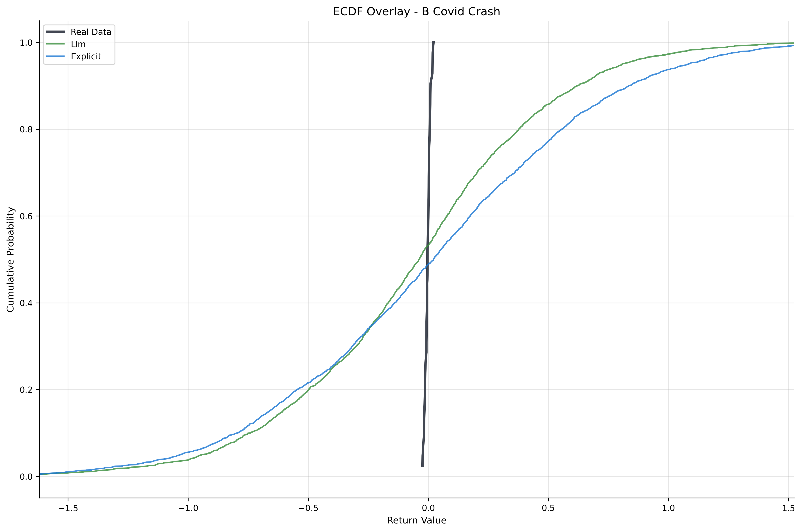
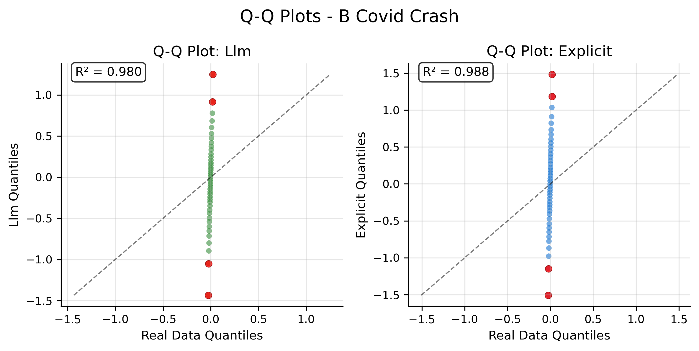

# Shared Plotting Utilities

Publication-quality visualization tools for financial time series experiment results. Creates consistent, professional plots with graceful error handling and comprehensive output formats.

## Features

- **ECDF Overlays**: Real data vs all models with consistent axes
- **Q-Q Plots**: Both tail analysis with R² correlation metrics
- **VaR/ES Analysis**: Risk overlays with exceedance timelines
- **Realized Volatility**: Tracking plots with RMSE in legends
- **Multiple Formats**: PDF and PNG output for publication/web use
- **Graceful Handling**: "SKIPPED" placeholder panels for missing data
- **Versioning Safety**: Creates _v2.py files to avoid overwrites

## Quick Start

### List Available Data

```bash
python plotting_runner.py --list-available
```

Output:
```
Available Experiments and Windows with Metrics:
==================================================
A:
  - covid_crash

B:
  - covid_crash
```

### Generate All Plots

```bash
# Create plots for all experiments and windows
python plotting_runner.py

# Create plots for specific experiments
python plotting_runner.py --experiments B

# Create plots for specific windows
python plotting_runner.py --windows covid_crash

# Custom results directory
python plotting_runner.py --results-base my_results
```

## Command Line Arguments

| Argument | Description | Default |
|----------|-------------|---------|
| `--results-base` | Base directory with experiment results | `results/addons/period_slices` |
| `--experiments` | Specific experiments to process | All available |
| `--windows` | Specific windows to process | All available |
| `--list-available` | List available experiments and exit | - |
| `--output-formats` | Output formats for plots | `['pdf', 'png']` |

## Plot Types Generated

### 1. ECDF Overlay
**File**: `ecdf_overlay.pdf/png`

**Purpose**: Compare empirical cumulative distribution functions
- Real data in dark gray (thicker line)
- Each model in distinct colors
- Shows overall distribution matching
- Consistent axes across all experiments

**Key Features**:
- Automatic axis scaling (1st-99th percentiles)
- Professional color palette
- Clear model identification
- Grid and transparency for readability

### 2. Q-Q Plots
**File**: `qq_plots.pdf/png`

**Purpose**: Quantile-quantile analysis with tail focus
- Separate subplot for each model
- Real data quantiles vs generated quantiles
- Highlighted tail quantiles (≤5%, ≥95%)
- R² correlation metrics

**Key Features**:
- Red highlights for extreme quantiles
- Diagonal reference line
- R² goodness-of-fit display
- Automatic layout for multiple models

### 3. VaR/ES Analysis
**File**: `var_es_analysis.pdf/png`

**Purpose**: Risk analysis with temporal exceedances
- **Top Panel**: Returns with VaR overlays
- **Bottom Panel**: Exceedance timeline

**Risk Levels**:
- 95% VaR (solid lines)
- 99% VaR (dashed lines)
- Exceedance markers on timeline

**Key Features**:
- Date-formatted x-axes
- Color-coded by model
- Exceedance indicators (triangles)
- Professional risk visualization

### 4. Realized Volatility Tracking
**File**: `realized_volatility.pdf/png`

**Purpose**: Volatility pattern comparison with performance metrics
- Rolling 20-day volatility
- Real data vs model averages
- RMSE and correlation in legends

**Metrics Displayed**:
- RMSE: Root mean squared error
- ρ: Pearson correlation coefficient
- Path averaging for stable estimates

## Output Structure

```
results/addons/period_slices/<experiment>/<window>/figs/
├── ecdf_overlay.pdf              # Distribution comparison
├── ecdf_overlay.png
├── qq_plots.pdf                  # Quantile analysis
├── qq_plots.png
├── var_es_analysis.pdf           # Risk metrics
├── var_es_analysis.png
├── realized_volatility.pdf       # Volatility tracking
└── realized_volatility.png
```

## Color Palette

### Model Colors
- **Real Data**: `#2E3440` (Dark gray, prominent)
- **Zero Model**: `#D32F2F` (Red, baseline)
- **Explicit Model**: `#1976D2` (Blue, conditioning)
- **LLM Model**: `#388E3C` (Green, AI-enhanced)

### Risk Colors
- **95% VaR**: `#FF5722` (Red-orange)
- **99% VaR**: `#D32F2F` (Red)
- **95% ES**: `#FF8A65` (Light red-orange)
- **99% ES**: `#E57373` (Light red)

### Mode Colors (Experiment B)
- **Real Conditions**: `#388E3C` (Green)
- **Calm Conditions**: `#1976D2` (Blue)
- **LLM Knob**: `#F57C00` (Orange)

## Example Usage

### 1. Complete Visualization Pipeline

```bash
# First generate metrics, then plots
python metrics_runner.py --csv-file sp500_data.csv
python plotting_runner.py
```

Expected output:
```
PLOTTING PIPELINE SUMMARY
============================================================
Status: completed
Results Base: results/addons/period_slices
Total Attempted: 2
Total Success: 2
Success Rate: 100.0%

A:
  covid_crash: success (4 plots)
    → results/addons/period_slices/A/covid_crash/figs

B:
  covid_crash: success (4 plots)
    → results/addons/period_slices/B/covid_crash/figs
```

### 2. Experiment-Specific Analysis

```bash
# Focus on controllability results
python plotting_runner.py --experiments B
```

### 3. Window-Specific Analysis

```bash
# Analyze multiple stress periods
python plotting_runner.py --windows covid_crash covid_recovery
```

## Plot Interpretation

### ECDF Overlay Analysis
```python
# What to look for:
# - Overlapping curves = similar distributions
# - Separated curves = different risk profiles
# - Real data curve position relative to models
```

**Good Model**: ECDF closely follows real data across all quantiles
**Poor Model**: Large deviations, especially in tails

### Q-Q Plot Analysis
```python
# R² > 0.95: Excellent quantile matching
# R² 0.80-0.95: Good matching with some deviations
# R² < 0.80: Poor distributional match
```

**Red tail points on diagonal**: Accurate extreme quantile modeling
**Red tail points off diagonal**: Tail modeling issues

### VaR/ES Analysis
```python
# Exceedance rate ≈ 5% for 95% VaR: Well-calibrated
# Clustered exceedances: Model captures volatility clustering
# No exceedances: Overly conservative model
```

### Realized Volatility Tracking
```python
# High correlation (ρ > 0.8): Good volatility dynamics
# Low RMSE: Accurate volatility levels
# Parallel curves: Consistent volatility patterns
```

## Advanced Usage

### Load and Analyze Plots Programmatically

```python
from shared_plotting import PlottingPipeline, PlotGenerator
import numpy as np

# Initialize
pipeline = PlottingPipeline()
plot_gen = PlotGenerator()

# Load your data
real_data = np.load('real_returns.npy')
model_samples = {
    'explicit': np.load('explicit_samples.npy'),
    'llm': np.load('llm_samples.npy')
}

# Create individual plots
fig_ecdf = plot_gen.create_ecdf_overlay(real_data, model_samples)
fig_qq = plot_gen.create_qq_plots(real_data, model_samples)
fig_var = plot_gen.create_var_es_overlay(real_data, model_samples)
fig_vol = plot_gen.create_realized_vol_tracking(real_data, model_samples)

# Save with custom names
fig_ecdf.savefig('my_ecdf_analysis.pdf', dpi=300, bbox_inches='tight')
```

### Custom Color Schemes

```python
from shared_plotting import ColorPalette

# Create custom color palette
colors = ColorPalette()
colors.model_colors['my_model'] = '#FF6B6B'  # Custom red
colors.model_colors['baseline'] = '#4ECDC4'  # Custom teal

# Use in plotting
plot_gen = PlotGenerator(color_palette=colors)
```

### Error Handling and Graceful Degradation

The plotting system handles missing or corrupted data gracefully:

- **Missing sample files**: Creates "SKIPPED" placeholder
- **Corrupt data**: Shows error message panel
- **Insufficient data**: Displays warning in plot
- **Invalid metrics**: Continues with available data

This ensures that report compilation never fails due to data issues.

## Integration with LaTeX Reports

### PDF Output for LaTeX
```latex
\documentclass{article}
\usepackage{graphicx}

\begin{document}

\section{Model Comparison}

\begin{figure}[htbp]
    \centering
    \includegraphics[width=0.8\textwidth]{results/addons/period_slices/B/covid_crash/figs/ecdf_overlay.pdf}
    \caption{Empirical CDF comparison for Experiment B during COVID crash period.}
    \label{fig:ecdf_B_covid}
\end{figure}

\begin{figure}[htbp]
    \centering
    \includegraphics[width=0.8\textwidth]{results/addons/period_slices/B/covid_crash/figs/var_es_analysis.pdf}
    \caption{VaR/ES analysis showing risk exceedances during COVID crash.}
    \label{fig:var_B_covid}
\end{figure}

\end{document}
```

### PNG Output for Web/Presentations
```html
<!-- Web report integration -->
<div class="experiment-results">
    <h2>Experiment B: Controllability Analysis</h2>
    
    <div class="plot-grid">
        
        
    </div>
</div>
```

## Quality Assurance

### Publication Standards
- **DPI**: 300 for print quality
- **Font Sizes**: Consistent, readable scales
- **Color Blind Friendly**: Distinct colors with different line styles
- **Grid Lines**: Subtle, non-intrusive
- **Legends**: Clear model identification

### Consistency Checks
- **Axis Scaling**: Automatic, data-driven
- **Color Mapping**: Consistent across all plots
- **Layout**: Professional spacing and margins
- **Error Handling**: Graceful degradation

### File Management
- **Dual Format**: Both PDF (vector) and PNG (raster)
- **Organized Structure**: Clear directory hierarchy
- **Naming Convention**: Descriptive, consistent names
- **Versioning**: Safe overwrite protection

## Troubleshooting

### Common Issues

#### No Plots Generated
```
Warning: No sample data found for A/covid_crash
```
**Solution**: Run experiments and metrics first:
```bash
python experiment_A_evaluator.py --window covid_crash
python metrics_runner.py --experiments A
python plotting_runner.py --experiments A
```

#### Missing Metrics
```
Available Experiments and Windows with Metrics:
==================================================
No experiments with metrics found.
```
**Solution**: Generate metrics before plotting:
```bash
python metrics_runner.py --csv-file sp500_data.csv
```

#### Plot Errors
```
Error creating plots for B/covid_crash: ...
```
**Solution**: Check data integrity and file permissions:
```bash
ls -la results/addons/period_slices/B/covid_crash/
python -c "import numpy as np; print(np.load('results/.../samples.npy').shape)"
```

### Memory Issues

For large datasets:
```bash
# Process one experiment at a time
python plotting_runner.py --experiments A
python plotting_runner.py --experiments B
```

### Custom Windows

Add new windows to plotting pipeline:
```python
# In shared_plotting.py, _get_window_real_data()
window_periods = {
    'covid_crash': ('2020-02-20', '2020-04-01'),
    'my_window': ('2023-01-01', '2023-03-31')  # Add here
}
```

## Performance Considerations

### Generation Time
- **4 plots per window**: ~30-60 seconds
- **PDF + PNG**: Minimal overhead
- **Multiple models**: Linear scaling

### File Sizes
- **PDF**: 50-200KB per plot (vector format)
- **PNG**: 100-500KB per plot (300 DPI)
- **Total per window**: ~1-3MB

### Scalability
- **Memory**: Scales with sample size
- **Processing**: Scales with number of models
- **Storage**: Linear with number of windows

## Best Practices

1. **Run Pipeline Order**: Experiments → Metrics → Plots
2. **Check Availability**: Use `--list-available` before plotting
3. **Incremental Generation**: Plot specific experiments/windows for testing
4. **Quality Review**: Check PDF output for publication quality
5. **Version Control**: Plots auto-update when data changes
6. **Error Monitoring**: Review plotting manifest for issues
7. **Format Selection**: PDF for LaTeX, PNG for web/presentations

## Future Extensions

### Additional Plot Types
- **Autocorrelation**: Return and volatility persistence
- **Regime Analysis**: Temporal model behavior
- **Multi-horizon**: Different forecast horizons
- **Risk Decomposition**: Component-wise analysis

### Interactive Features
- **Plotly Integration**: Interactive web plots
- **Parameter Sweeps**: Animated model comparisons
- **Zoom Capabilities**: Detailed tail analysis
- **Model Selection**: Toggle model visibility

### Export Options
- **SVG**: Scalable vector graphics
- **EPS**: Encapsulated PostScript
- **TIFF**: High-resolution raster
- **Combined PDFs**: Multi-page reports

The shared plotting utilities provide a comprehensive, professional visualization pipeline that ensures consistent, publication-quality results across all experiments while maintaining robustness and ease of use.
