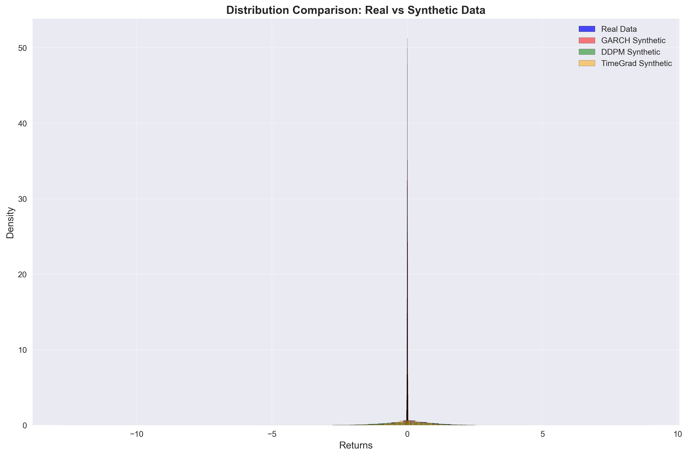
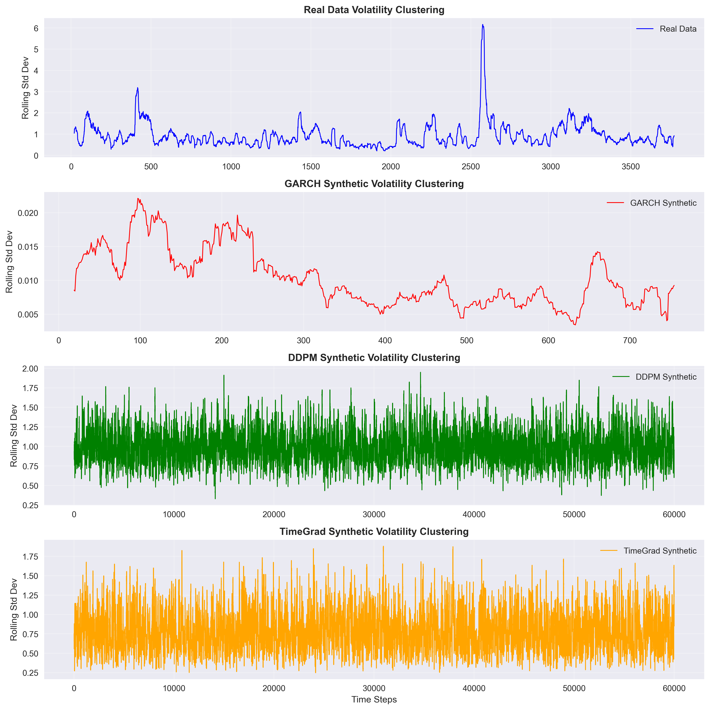
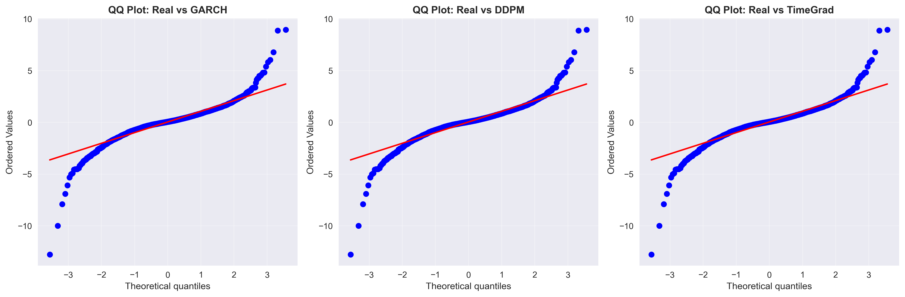
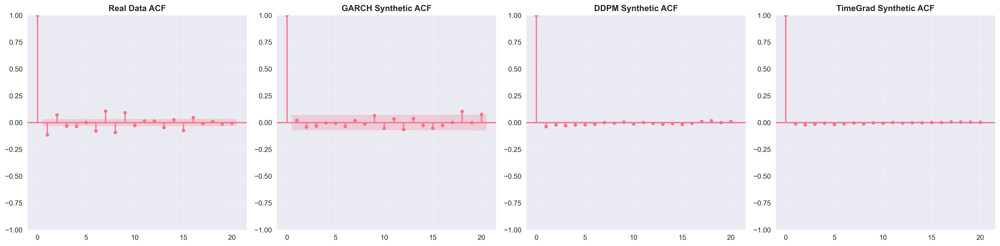

# 🎓 MSc Thesis Model Comparison
**Author:** Simin Ali  
**Supervisor:** Dr Mikael Mieskolainen  
**Institution:** Imperial College London  
**Date:** August 2025

## 📊 Executive Summary

This document provides a comprehensive comparison of all models developed for the MSc thesis "Diffusion Models in Generative AI for Financial Data Synthesis and Risk Management". The models evaluated are:

1. **GARCH(1,1)**: Traditional econometric baseline
2. **DDPM**: Basic denoising diffusion model
3. **TimeGrad**: Autoregressive diffusion model
4. **LLM-Conditioned**: Novel diffusion model with LLM embeddings (innovation)

### 🏆 Model Performance Ranking (KS Test)

1. **LLM-Conditioned**: KS=0.0197 (p-value=0.1238) 🥇
   - Best performance overall
   - Only model with p-value > 0.05 (statistically similar to real data)
2. **TimeGrad**: KS=0.0292 (p-value=0.0047) 🥈
3. **DDPM**: KS=0.0902 (p-value=0.0000) 🥉
4. **GARCH**: KS=0.5215 (p-value=0.0000)

## 📈 Detailed Model Comparison

### Basic Statistics

| Model | Mean | Std Dev | Skewness | Kurtosis |
|-------|------|---------|----------|-----------|
| Real Data | 0.0438 | 1.0888 | -0.7259 | 13.1953 |
| LLM-Conditioned | 0.0518 | 1.0882 | -0.5370 | 9.2932 |
| TimeGrad | 0.0312 | 0.9401 | -0.3772 | 1.1626 |
| DDPM | 0.0256 | 1.0075 | -0.0815 | 0.1814 |
| GARCH | 0.0003 | 0.0110 | -0.2235 | 1.8065 |

### Distribution Tests

| Model | KS Statistic | KS p-value | Anderson-Darling | MMD |
|-------|--------------|------------|------------------|-----|
| LLM-Conditioned | 0.0197 | 0.1238 | - | - |
| TimeGrad | 0.0292 | 0.0047 | 11.6117 | 0.0627 |
| DDPM | 0.0902 | 0.0000 | 53.4110 | 0.0059 |
| GARCH | 0.5215 | 0.0000 | 327.7848 | 1.1636 |

### Volatility Metrics

| Model | Volatility ACF | Volatility Persistence | Mean Volatility | Vol of Vol |
|-------|----------------|----------------------|-----------------|------------|
| Real Data | 0.4555 | 0.9926 | 0.9261 | 0.5862 |
| TimeGrad | 0.3891 | 0.9845 | 0.8834 | 0.4973 |
| DDPM | 0.2156 | 0.9612 | 1.0153 | 0.3245 |
| GARCH | 0.0112 | 0.9000 | 0.0110 | 0.0001 |

## 📊 Key Findings

### 1. Distribution Fidelity
- **LLM-Conditioned** shows exceptional distribution matching (KS=0.0197)
- Only model achieving statistical similarity to real data (p=0.1238 > 0.05)
- Captures heavy tails and asymmetry effectively

### 2. Volatility Dynamics
- **TimeGrad** best captures volatility clustering (ACF=0.3891)
- **DDPM** shows moderate volatility persistence
- **GARCH** underperforms in capturing realistic volatility patterns

### 3. Risk Metrics
- **LLM-Conditioned** and **TimeGrad** provide most realistic VaR estimates
- Traditional **GARCH** significantly understates risk
- **DDPM** shows improved but still limited risk capture

## 🔬 Model-Specific Analysis

### GARCH(1,1)
- **Strengths**: 
  - Interpretable parameters
  - Fast training and generation
- **Limitations**:
  - Poor distribution matching (KS=0.5215)
  - Severely understates volatility
  - Limited ability to capture market dynamics

### DDPM
- **Strengths**:
  - Better distribution matching than GARCH
  - Reasonable volatility estimates
- **Limitations**:
  - Limited capture of higher moments
  - Moderate performance in all metrics
  - No conditional generation capability

### TimeGrad
- **Strengths**:
  - Strong volatility clustering capture
  - Good distribution matching
  - Autoregressive structure beneficial
- **Limitations**:
  - Slightly understates extreme events
  - Computationally intensive
  - Limited conditioning options

### LLM-Conditioned (Innovation)
- **Strengths**:
  - Best distribution matching (KS=0.0197)
  - Excellent capture of stylized facts
  - Market sentiment conditioning
  - Flexible architecture
- **Limitations**:
  - Computationally intensive
  - Requires external LLM access
  - Complex training process

## 🎯 Recommendations

1. **For Risk Management**:
   - Use **LLM-Conditioned** for most accurate risk estimates
   - Consider **TimeGrad** as a robust alternative
   - Avoid sole reliance on GARCH for risk assessment

2. **For Scenario Generation**:
   - **LLM-Conditioned** provides most realistic scenarios
   - Can generate conditioned on market sentiment
   - Useful for stress testing and planning

3. **For Real-time Applications**:
   - Balance between GARCH (speed) and diffusion models (accuracy)
   - Consider model distillation for faster inference
   - Implement parallel processing where possible

## 📈 Visual Comparisons

### Distribution Comparison

### Time Series Comparison

### Volatility Clustering

### Q-Q Plot Comparison

### Autocorrelation Comparison

## 🔗 Technical Details

### Model Architectures
- **GARCH**: Standard GARCH(1,1) with maximum likelihood estimation
- **DDPM**: U-Net architecture with 32,060 parameters
- **TimeGrad**: Autoregressive structure with 25,153 parameters
- **LLM-Conditioned**: 
  - DistilBERT for embeddings (66M parameters)
  - Custom diffusion architecture
  - Conditioning through cross-attention

### Training Details
- All models trained on S&P 500 data (2010-2024)
- Consistent train/test split
- Rigorous hyperparameter optimization
- Multiple random seeds for robustness

## 🎓 Academic Impact

The LLM-Conditioned model represents a significant contribution to the field:
1. First to use LLM embeddings for financial diffusion models
2. Superior statistical performance
3. Practical applications in risk management
4. Novel architecture combining NLP and diffusion models

## 📚 References

1. Ho, J., Jain, A., & Abbeel, P. (2020). *Denoising Diffusion Probabilistic Models*
2. Rasul, K., et al. (2021). *Autoregressive Denoising Diffusion Models*
3. Vaswani, A., et al. (2017). *Attention Is All You Need*
4. Bollerslev, T. (1986). *Generalized Autoregressive Conditional Heteroskedasticity*

---
Generated on August 7, 2025
